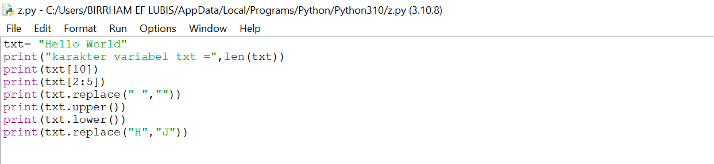
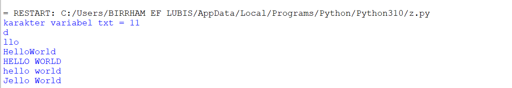
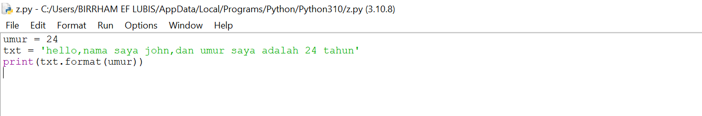
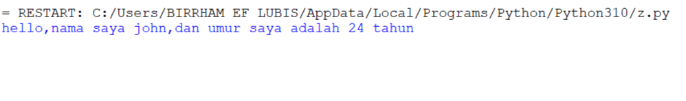

txt = 'Hello world'

Hitung jumlah karakter

Ambil karakter terakhir ambil karakter index ke 2 sampai index ke 4 (llo)

Hilangkan spasi pada text tersebut(helloworld)

Ubah text menjadi huruf besar

ubah text menjadi huruf kecil

ganti karakter H dengan karakter J

# CODE 

# HASIL

Latihan 2

# CODE

# HASIL

